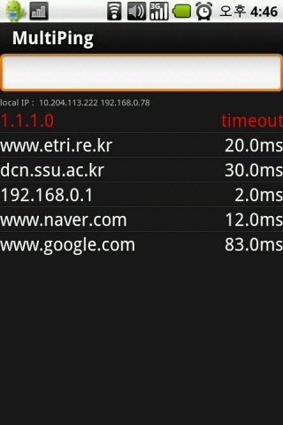
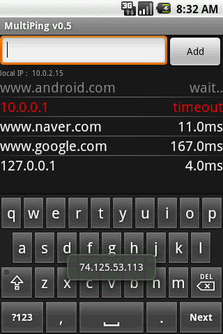
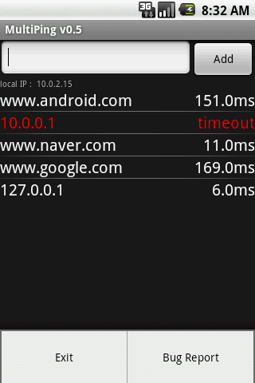
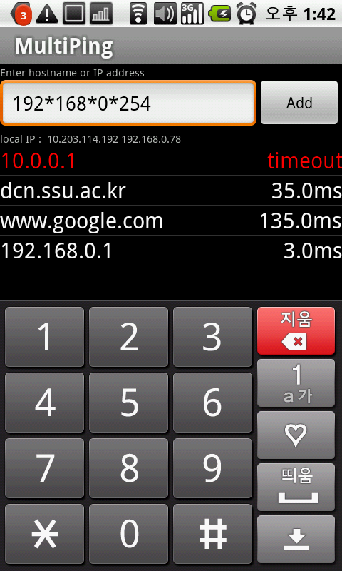
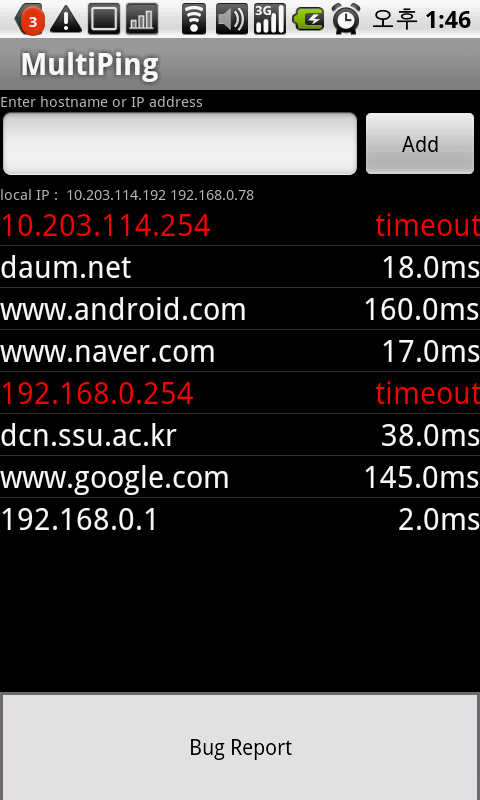

# Fork Updates

Updated to latest gradle and Android platform 32.

Added port number functionality.

To ping a specific port, enter the IP address folowwed by : then the port number.

ex: 192.168.1.100:443

# MultiPing for Android

## Features

The "ping" application supports multiple destinations to check IP connectivity.

* Translate "*" to dot
* Maximum 12 hostnames or IP addresses support.
* Update delay about every 5 secs.
* Trying to connect TCP port 80 or TCP echo port.
* Display my local IP addresses
* admob

## Download

* [F-Droid)[https://f-droid.org/repository/browse/?fdid=kr.softgear.multiping]

## Screenshots

